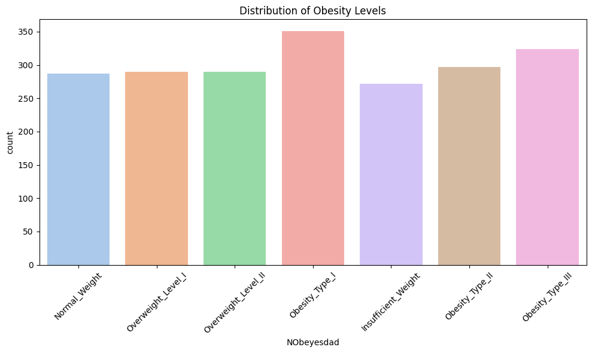
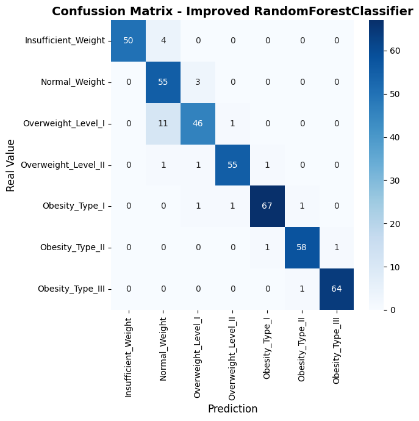
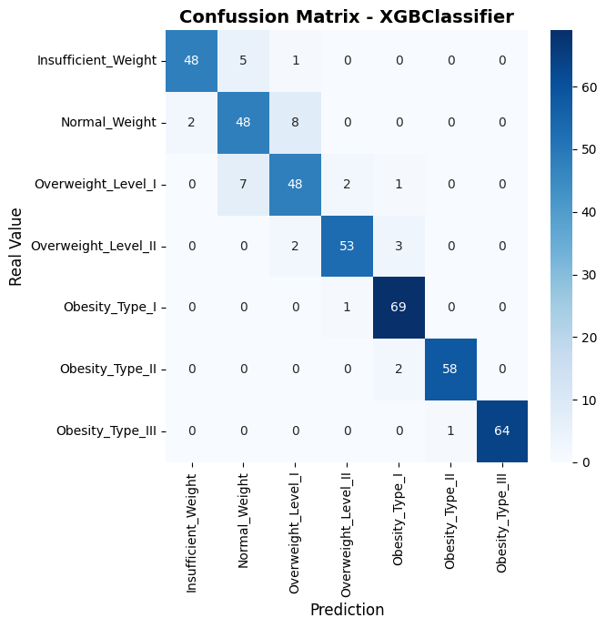
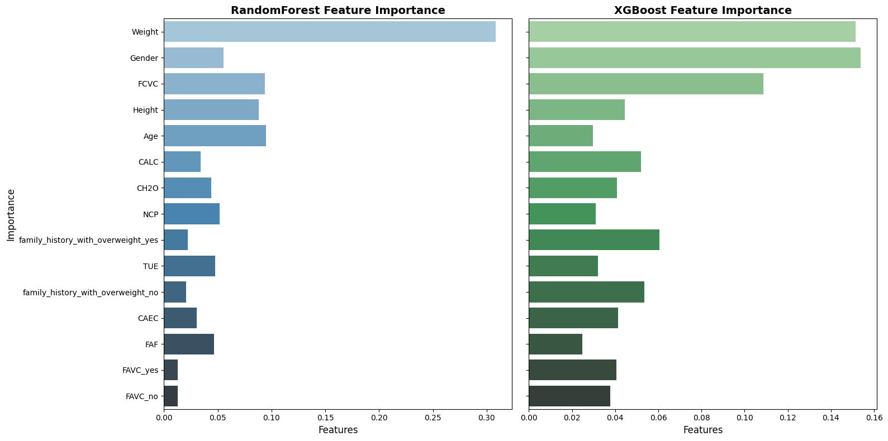

# Predicting-Obesity-Levels-with-Machine-Learning
A Data Science Project Using UCI’s Lifestyle and Eating Habits Dataset.

## Overview 
This project explores how eating, habits, physical activity, and lifestyle choices influece obesity leves. Using the **UCI "Estimation of Obesity Levels Based on Eating Habits and Physical Condition** dataset, I will perform an exploratory data analysis (EDA), feature importance evaluation, and machine learning classification to identify the main factores that contribute to obesity.

## Objectives
1. **Indentify the main factores associated with obesity levels.**
2. **Develop a predictive model** capable of classifying individuals into obesity categories.
3. **Evaluate the influence of eating and exercise habits** using feature importance techniques.
4. **Visualize relationships** between lifestyle variables and obesity levels.

## Dataset
- **Source:** [UC Irvine Machine Learning Repository](https://archive.ics.uci.edu/dataset/544/estimation+of+obesity+levels+based+on+eating+habits+and+physical+condition)
- **Instances:** 2111
- **Features:** 17

### Example Features:
| Variable | Description |
|-----------|--------------|
| Gender | Male / Female |
| Age | Age of the individual |
| Height / Weight | Physical condition |
| FCVC | Frequency of vegetable consumption |
| NCP | Number of main meals per day |
| CH2O | Daily water intake |
| FAF | Frequency of physical activity |
| TUE | Time using technology devices |
| CALC | Alcohol consumption |
| NObeyesdad | Obesity level (target variable) |

## Target Distribution (NObeyesdad)

## Models 
### RandomForest Classifier
RandomForest is an ensemble model learning method based on multiple decision trees.
Each tree is trained on a randomsubset of the data and features, and their predictios are averaged to reduce overffitng and improve generalization.
It was chosen for its **robustness with mixed data types**, its **resistance to noise**, and its ability to provide **feature importance** for interpretation.

### XGBoost Classifier
XGBoost (Extreme Gradient Boosting) is a highly efficient boosting algorithm that builds trees sequentially, with each new tree correcting the errors of the previous ones.
It is widely used for its **speed, regularization**, and **excellent performance on tabular data**.
In this project, XGBoost achieved results comparable to the optimized RandomForest, showing strong capability to model **nonlinera relationships** between features. 

## Confussion Matrix 
###  RandomForest Classifier (RandomizedSearchCV) 
The confussion matrix is the following:

The interpretation of the confusion matrix is the following:
- **Class 0 - Insufficient Weight**:
    - 50 people with insufficient weight were classified correctly with *Insufficient_Weight.*
    - 4 people were classified with *Normal_Weight*.

- **Class 1 - Normal Weight**:
    - 55 people with normal weight were classified correctly with *Normal_Weight*.
    - 3 people were classified with *Insufficient_Weight*.
  
- **Class 2 - Overweight Level I**:
    - 46 people were classified correctly with *Overweight_Level_I*
    - 11 people were classified with *Normal_Weight*.
    - 1 person was classified with *Overweight_Level_II*.
    - 
- **Class 3 - Overweight Level II**:
    - 55 people were classified correctly with *Overweight_Level_II*.
    - 1 person was classified with *Normal_Weight*.
    - 1 person was classified with *Overweight_Level_I*.
    - 1 person was classified with *Obesity_Type_I*.
    - 
- **Class 4 - Obesity Type I**:
    - 67 people were classified correctly with *Obesity_Type_I*.
    - 1 person was classified with *Overweight_Level_I.*
    - 1 person was classified with *Overweight_Level_II.*
    - 1 person was classified with *Obesity_Type_II.*
    
- **Class 5 - Obesity Type II**:
    - 58 people were classified correctly with *Obesity_Type_II**.
    - 1 person was classified with *Obesity_Type_I*.
    - 1 person was classified with *Obesity_Type_III*.

- **Class 6 - Obesity Type III**:
    - 64 people were classifed correclty with *Obesity_Type_III.*
    - 1 person was classified with *Obesitiy_Type_II*.

### XGBoost Classifier
The confussion matrix is the following:
 

The interpretation of the confusion matrix is the following:
- **Class 0 - Insufficient Weight**:
    - 48 people with insufficient weight were classified correctly with *Insufficient_Weight.*
    - 5 people were classified with *Normal_Weight*.
    - 1 person was classified with *Overweight_Level_I.*

- **Class 1 - Normal Weight**:
    - 48 people with normal weight were classified correctly with *Normal_Weight*.
    - 2 people were classified with *Insufficient_Weight*.
    - 8 people were classified with *Overweight_Level_I*.
  
- **Class 2 - Overweight Level I**:
    - 48 people were classified correctly with *Overweight_Level_I*
    - 7 people were classified with *Normal_Weight*.
    - 2 people were classified with *Overweight_Level_II*.
      
- **Class 3 - Overweight Level II**:
    - 53 people were classified correctly with *Overweight_Level_II*.
    - 2 people were classified with *Overweight_Level_I*.
    - 3 people were classified with *Obesity_Type_I*.
      
- **Class 4 - Obesity Type I**:
    - 69 people were classified correctly with *Obesity_Type_I*.
    - 1 person was classified with *Overweight_Level_II.*
    
- **Class 5 - Obesity Type II**:
    - 58 people were classified correctly with *Obesity_Type_II**.
    - 2 people were classified with *Obesity_Type_I*.

- **Class 6 - Obesity Type III**:
    - 64 people were classifed correclty with *Obesity_Type_III.*
    - 1 person was classified with *Obesitiy_Type_II*.

## Model Performance Comparison
| Model                 | Accuracy | Precision | Recall | F1-score | ROC-AUC |
|------------------------|----------|------------|---------|-----------|----------|
| Random Forest (Randomized Search) | 0.9409 | 0.9483 | 0.9409 | 0.9417 | 0.9946 |
| XGBoost Classifier     | 0.9173 | 0.9189 | 0.9173 | 0.9176 | 0.9934 |

Both models achieved **very similar and high performance**, confirming that ensemble tree-based methods are effective for this type of classification problem.

## Feature Importance 
### **RandomForest (Randomized Search)**
| Rank | Variable | Importancia |
|------|-----------|-------------|
| 1 | Weight | 0.3081 |
| 2 | Age | 0.0949 |
| 3 | FCVC | 0.0939 |
| 4 | Height | 0.0883 |
| 5 | Gender | 0.0552 |
| 6 | NCP | 0.0516 |
| 7 | TUE | 0.0475 |
| 8 | FAF | 0.0467 |
| 9 | CH2O | 0.0438 |
| 10 | CALC | 0.0342 |

**Weight, Age, FCVC and Height** were the most influential. 

### **XGBoost Classifier** 

| Rank | Variable | Importancia |
|------|-----------|-------------|
| 1 | Gender | 0.1537 |
| 2 | Weight | 0.1514 |
| 3 | FCVC | 0.1087 |
| 4 | family_history_with_overweight_yes | 0.0604 |
| 5 | family_history_with_overweight_no | 0.0535 |
| 6 | CALC | 0.0520 |
| 7 | Height | 0.0446 |
| 8 | CAEC | 0.0414 |
| 9 | CH2O | 0.0408 |
| 10 | FAVC_yes | 0.0406 |

The variables that stood ut were **Gender, Weigth, FCVC** as the most important features. As well with features related with **family history with overweight** and **eating habits**. 

Visual comparison between RandomForest and XGBoost.

### Model Evaluation
To evaluate the stability and generalization of both models, it was applied a Stratified K-Fodl with 5 partitions.
This guarantees that the class proportions remains balanced in each iteration.
| Model |  Accuracy (CV Mean ± SD) | Interpretation|
|-------|---------------------|---------|
| **Random Forest (Randomized Search)** | 0.9402 ±0.0114 | High performance and consistency between folds |
| **XGBoost Classifier** | 0.9396 ± 0.0061|Similar performance to RandomForest, with lower variance, but inferior in overall metrics | 

### Interpretation
- Both models have **high predictive capacity**, surpassing 93% accuracy.
- **Optimized RandomForest** was slightly superior, being the better option for interpretation and with training times.
- Both models stand out **Weight, Height and FCVC (Frequency of vegetable consumption) as important features.
- The last suggets that a **combination of physical and eating habits** offer a better predictive understanding to estimate the obesity levels.

## Future Work
- Test other ensemble algorithms like **LightGBM** or **CatBoost**.
- Use **SHAP values** for more interpretable feature importance.
- Apply **class balancing techniques.
- Deploy thre trained model via an **API** or **interactive dashboard** for real-time predictions.
  
### 🧾 Summary

This project demonstrates how **machine learning models can effectively classify obesity levels** using lifestyle, eating habits, and genetic predisposition variables.  
Both Random Forest and XGBoost achieved high accuracy and stability, making them suitable for predictive analysis in health-related datasets.
